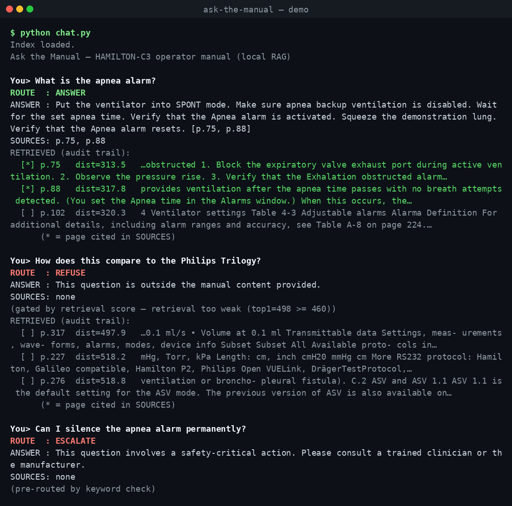

# ask-the-manual

A fully-local **retrieval-augmented Q&A assistant** over the HAMILTON-C3 ventilator
operator manual. It answers questions using **only** the manual, runs entirely on
local hardware (no cloud, no API key), and enforces four safety-aware response
routes with a transparent retrieval audit trail.

> ⚠️ **Educational/demo project.** Not for clinical use or medical decision-making.
> Answers are grounded in a third-party operator manual; see [provenance](#provenance).



*Three of the four routes in one session: a grounded **ANSWER** with its retrieval
audit trail, a gated **REFUSE**, and a keyword-pre-routed **ESCALATE**.*

## How it works

```
PDF (372 pages)
  └─ extract_pages.py  ──▶ pages.json (365 non-empty pages)
       └─ build_index.py ──▶ 978 chunks ──▶ FAISS index (nomic-embed-text)
            └─ chat.py / query.py, per question:
                 keyword pre-route ──▶ retrieval-score gate ──▶ retrieve top-3
                   ──▶ Gemma (few-shot, temp 0) ──▶ parse + citation guard
                   ──▶ routed answer + audit trail
```

Everything after the one-time index build runs locally on the GPU.

## Stack

| Layer | Choice |
|-------|--------|
| Runtime | [Ollama](https://ollama.com) (systemd service) |
| Embeddings | `nomic-embed-text` (768-dim) |
| Generation | `gemma3:4b` (100% GPU offload, ~155 tok/s on an RTX 3090) |
| Vector store | FAISS (`faiss-cpu`) |
| Orchestration | LangChain 1.x, Python 3.12 |

## The four response routes

| Route | How it's enforced |
|-------|-------------------|
| **ESCALATE** | Deterministic keyword pre-route (e.g. `silence`+`permanently`, `disable`) — fires *before* the model or retrieval, so it never depends on the model cooperating. |
| **REFUSE** | Deterministic retrieval-score gate: if the closest chunk's distance ≥ 460, nothing in the manual is relevant → refuse (model's own REFUSE is a second layer). |
| **CLARIFY** | Two mechanisms for two failure modes: the score gate catches *off-manual* vagueness (weak retrieval); few-shot prompting catches *on-manual* vagueness (a close but under-specified question like "tell me about the settings"). |
| **ANSWER** | Grounded generation from retrieved context only, plus a citation guard that flags any cited page not in the retrieved set. |

**Design principle:** use deterministic logic where a signal exists (keyword match,
retrieval distance); use few-shot where the decision is purely semantic.

## Setup

Requires [Ollama](https://ollama.com) running locally with the two models pulled:

```bash
ollama pull nomic-embed-text
ollama pull gemma3:4b

python3 -m venv venv
./venv/bin/pip install -r requirements.txt
```

Build the index (one-time, ~47s; only re-run if the manual changes):

```bash
./venv/bin/python extract_pages.py   # PDF ──▶ pages.json + manual_manifest.json
./venv/bin/python build_index.py     # ──▶ faiss_index/
```

## Usage

```bash
./venv/bin/python chat.py                  # interactive REPL with audit trail
./venv/bin/python chat.py --show-context   # also dump full retrieved chunks
./venv/bin/python query.py                 # canned 4-route test
```

Exit the REPL with `exit` / `quit` / `q` / `:q`, or Ctrl-D. Every session is logged
to `sessions/session_<timestamp>.log`.

Example:

```
You> What is the apnea alarm?
ROUTE  : ANSWER
ANSWER : Put the ventilator into SPONT mode. Make sure apnea backup ventilation
         is disabled. Wait for the set apnea time. ... [p.75, p.88]
SOURCES: p.75, p.88
RETRIEVED (audit trail):
  [*] p.75   dist=313.5   …obstructed 1. Block the expiratory valve exhaust port…
  [*] p.88   dist=317.8   provides ventilation after the apnea time passes…
  [ ] p.102  dist=320.3   4 Ventilator settings Table 4-3 Adjustable alarms…
      (* = page cited in SOURCES)
```

## Demo questions

`query.py` runs these five questions, which exercise every route:

| Question | Route | Mechanism |
|----------|-------|-----------|
| "What does the manual say about replacing the bacterial filter?" | **ANSWER** | grounded generation + citation guard |
| "Tell me about the settings" | **CLARIFY** | few-shot — vague but *on-manual* |
| "tell me stuff" | **CLARIFY** | retrieval-score gate — weak/*off-manual* match |
| "How does this compare to the Philips Trilogy?" | **REFUSE** | retrieval-score gate — nothing close in the manual |
| "Can I silence the apnea alarm permanently?" | **ESCALATE** | keyword pre-route — fires before the model |

The two CLARIFY cases are deliberate: the gate catches *off-manual* vagueness
("tell me stuff"), while few-shot catches *on-manual* vagueness ("tell me about
the settings") — which the gate can't, since that query is as close to the index
as a genuinely answerable one.

## Metrics

| | |
|---|---|
| Source pages | 372 (365 non-empty after extraction) |
| Chunks | 978 (800-char, 150 overlap) |
| Index build (one-time) | 46.7 s |
| Generation throughput | ~155 tok/s (`gemma3:4b`, 100% GPU) |
| Index size | 3.0 MB + 0.7 MB |
| Route accuracy | 5/5 test cases |

## Files

| File | Role |
|------|------|
| `extract_pages.py` | PDF → `pages.json` + `manual_manifest.json` (download/cache, extract, strip footers) |
| `build_index.py` | chunk → embed → FAISS |
| `query.py` | pipeline: pre-route, gate, retrieve, generate, parse, citation guard |
| `chat.py` | interactive CLI: `--show-context`, per-session logging |
| `manual_manifest.json` | source provenance (committed; the PDF itself is gitignored) |
| `DAY1_REPORT.md` | environment + PDF-verification notes |

Generated/runtime artifacts (`manual.pdf`, `pages.json`, `faiss_index/`,
`sessions/`, `venv/`) are gitignored — all regenerable from the scripts above.

## Provenance

`manual_manifest.json` records the source URL, a SHA256 of the exact PDF bytes
processed, the download timestamp, and intended use — so the corpus is auditable
even though the binary itself isn't version-controlled.

## Known limitations

- **Citations use PDF page order**, not the manual's printed page numbers. Fine for
  a demo; a production version would map between them for end-user accuracy.
- **Embedding build is serial** (one request per chunk). Batching would cut the
  47s build to a few seconds if rebuilds become frequent.
- **Gate thresholds (380 / 460)** are fit from a handful of probe queries; tune on
  more data before any real use.

## License

[MIT](LICENSE) © 2026 Robert Morales — applies to the code in this repository.
The HAMILTON-C3 operator manual is © Hamilton Medical and is **not** included or
relicensed here; only its public source URL and a SHA256 are recorded in
[`manual_manifest.json`](manual_manifest.json) for provenance.
